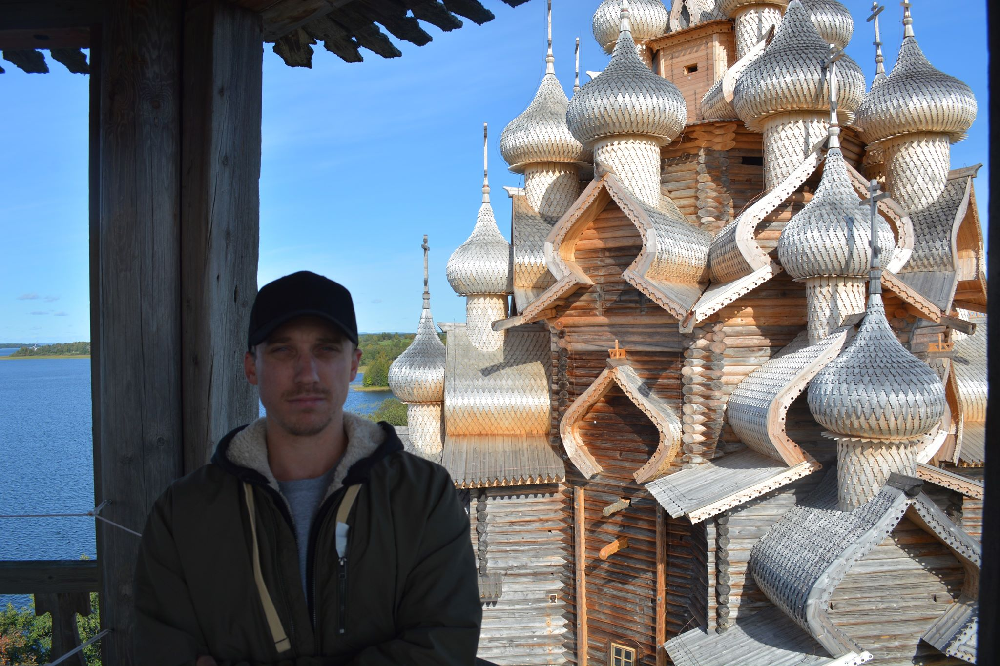
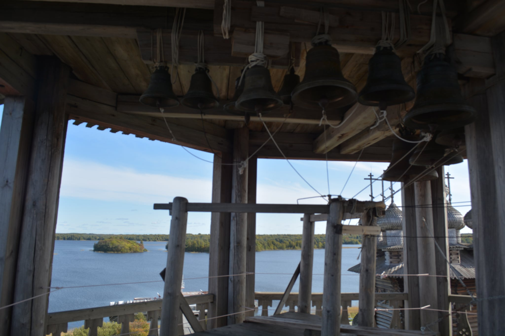
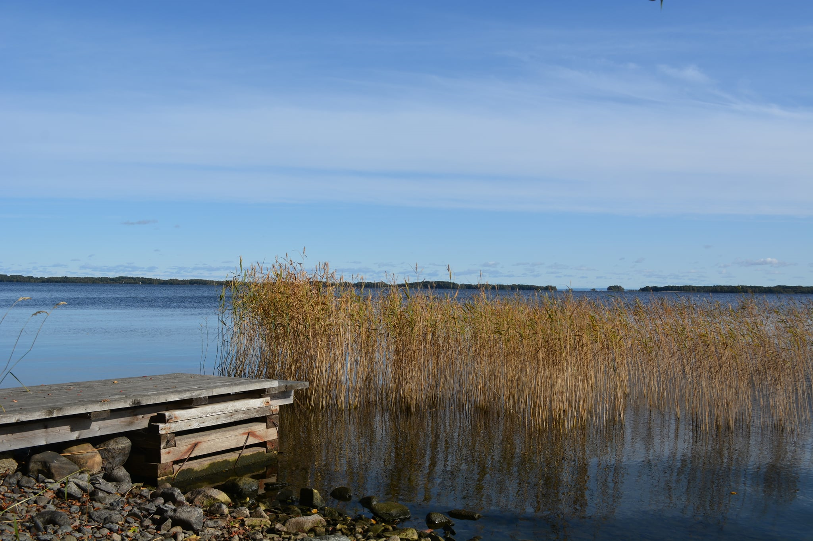

# The Kizhi Island Pigrimage
<i>September 2019</i>

## Introduction

Kizhi Island, Russia is home to the 17th-century Kizhi Pogost (<i>Кижский погост</i>), which is comprised of the Church of the Transfiguration (<i>Церковь Преображения Господя</i>), the Church of the Intercession of the Virgin Mary (<i>Церковь Покрова Пресвятой Богородицы</i>), and a bell tower; Orthodox Christian (<i>православный</i>) services are still held there to this day. 

Kizhi is located in the Korelia Region, which has alternately been under the jurisdiction of Sweden, Finland, and Russia. Joseph Stalin regained the territory from the Finns during the three-month Winter War of 1939 at the cost of around 150,000 Soviet lives citing the region's proximinity to Leningrad (modern-day Saint-Petersburg) as the reason for launching his invasion.

Kizhi Island is accessible from the nearby city of Petrozavodsk (<i>Петрозаводск</i>), the latter being founded in 1703 by Pyotr I the Great in order to exploit the region's rich iron ore resources for his burdgeoning Baltic Fleet, but archaeological evidence shows that the area has been inhabited for thousands of years. The eastern bank of Lake Onega is decorated by almost twenty kilometers of Neolithic period petroglyphs dated back more than 10,000 years.[1](#further-reading)

Even more confounding is the Petrozavodsk Phenomenon, which occurred in 1977. The phenomenon was a series of visual events which some have called a malfunctioning satellite that was launched by the Soviet government, some have called an environmental occurrance similar to the Aurora Borealis, and others have described as a visit by extraterrestrial life. Whatever happened that chilly September evening 42 years ago, the Academy of Sciences of the USSR (<i>Академия наук СССР</i>) launched an investigation into the events but was unable to reach any kind of definitive conclusion.[2](#further-reading)

Suffice to say, making the six-hour drive from Saint-Petersburg to Petrozavodsk and then the ninety-minute boat voyage to Kizhi Island itself was a small price to pay to visit a place with such storied history. This essay and its accompanying photographs seek to capture the beauty of Kizhi Island while providing some historical commentary to accompany those observations.

## Kizhi Island

Arriving at the docks in Petrozavodsk to begin the journey, I was expecting to find myself among endless tourists to the idyllic island-- I was not disappointed. We boarded the Soviet-era so-called Rocket boat and set off. Thankfully, because I was travelling independent of any kind of tour group, as soon as we docked on the island, I was able to break away from the crowd and explore the island for myself.

The island itself is brilliant; Kizhi is free from any kind of overcrowding, litter, or modernity in general-- a welcome change from Saint-Petersburg, a city of (officially) eight million. There are a handful of small communities across the island's five square kilometers, but they are only temporary residents. If one makes even a tertiary effort, it is not difficult to find yourself alone.

Walking along the shores of Kizhi Island, you encounter various seventeenth-, eighteenth-, and nineteenth-century wooden constructions designed in the classic Slavic style of woodworking which affords an architect the ability to join beams, thatch rooves, and build livable structures in many cases without the use of traditional iron nails. These techniques evolved primarily because of the surrounding resources of the region available to early settlers-- an abundance of timber but the technologies required to mine iron ore had yet to be developed.[3](#further-reading)

These methods eventually made their way back to Scandinavia in a sort of reverse cultural osmosis that occurred upon viking integration into Slavic societies during the nineth century. That is, Scandinavian settlers are generally credited with bringing new weapons and consumer technologies to the agrarian Eastern Slavs, but the latter are rarely credited with introducing the building methods that the former would spread in their respective homelands. 

It could be argued that the modern Ikea-style efficiency that Northern Europeans are known for is the result of Slavic influence.

## Kizhi Pogost

Kizhi Pogost was built using the aforementioned Slavic methods and resulted in an eighteen- and twenty-two domed church built without using a single iron nail. Guests are free to enter the Church of the Intercession, and climb the thirty-meter belfry to see the churches from above. Doing so reminded me how, depsite my best efforts, I was a part of the heaps of tourist which flood the island during the summer months. Chatting with an attendant at the top of the belfry, he said what I had just come to realize, 'they (tourists) are crawling all over this island like ants.' I could not help but agree, even if that meant that I was one of them.

Beyond my flagrant tourism, the most unsettling part of the journey was the vast security measures taken by the Russian government to ensure that the church does not fall victim to arson. The entire pogost is surrounded by enormous piping designed to be the first response to any fire occurring on the territory. There were national guardsmen (<i>Росгвардия</i>) and individuals from the Ministry of Civil Defense, Emergencies, and Disaster Management (<i>МЧС</i>) ready to act at a moment's notice. Clearly, Russia is not going to let a 'mysterious fire' with 'unknown causes' become the reason one of the last remaining wooden churches in Northwest Russia disappears from the face of the planet.

This inspired a contradictory reaction inside of me. On the one hand, what a world we live in that such a site would be vulnurable to arson. But the fact of the matter is, that it is. With the Notre Dame fire this year-- blamed on a greasy rag and careless cigarette butt-- as well Russia's own Dormition Church of Kondopoga in the same Karelia Region victim to 'careless tourists' who were never named[4](#further-reading), it seems that major Christian sites are increasingly susceptible to disappearing from the face of the planet. I was happy to see that Russia is so determined to preserve such an important part of its heritage. Meanwhile, my own growingly iconoclast homeland America is tearing down statues of controversial figures as fast as humanly possible. But I digress.

## Conclusion

Visiting Kizhi Island marked the first time I had traveled within the northwest of Russia since moving here almost four years ago. I've been to the south of course, I've been outside of the city to see the suburbs, but I'd never been deep into the Karelia Region beyond just the occassional train ride to Finland. For shame. Seeing the pristine nature, the endless skylines, the simplicity, and especially, Kizhi Island were well worth sitting in horrendous traffic both ways on a single-lane highway dotted with accidents from over-anxious drivers making passes a bit too closely.

Spending time on Kizhi Island reminded me why I yearn for small-town life, despite spending the majority of my life in the big city. Sitting down by the water and listening to the lake, listening to the bird, listening to nothing at all. No cell phones buzzing, no car horns blaring, no screaming people, no metro, no buses. Gerd Von Rundstedt once lamented that, 'the vastness of Russia devours us,' during the unsuccessful Operation Barbarossa, whereby Nazi Germany broke Rule #1 of conventional war and marched on Moscow. I certainly didn't feel devoured by the vastness of Russia, I felt embraced by her vastness.

## Further Reading

1. United Nations Educational, Scientific, and Cultural Organization (UNESCO); <i>[Petroglyphs of Lake Onega and the White Sea](https://whc.unesco.org/en/tentativelists/6358/)</i>; 2018
2. Gindilis, L.M., Menkov D.A., Petrovskaya I.G.; Academy of Sciences of the USSR; <i>[The 20 September Phenomenon: Description of Occurance. Preliminary Data Analysis](http://www.astronet.ru/db/msg/1169491/2_2.htm)</i> (in Russian); 1977
3. Fedorenko, O.A., Scheglova, T.K.; <i>[Traditional Building Techniques](https://www.altspu.ru/p_arh/english/tradition/build.html)</i>
4. The Moscow Times, <i>[Fire Destroys Historic Wooden Church Built in 1774](https://www.themoscowtimes.com/2018/08/10/fire-destroys-historic-church-built-in-1774-a62497)</i>