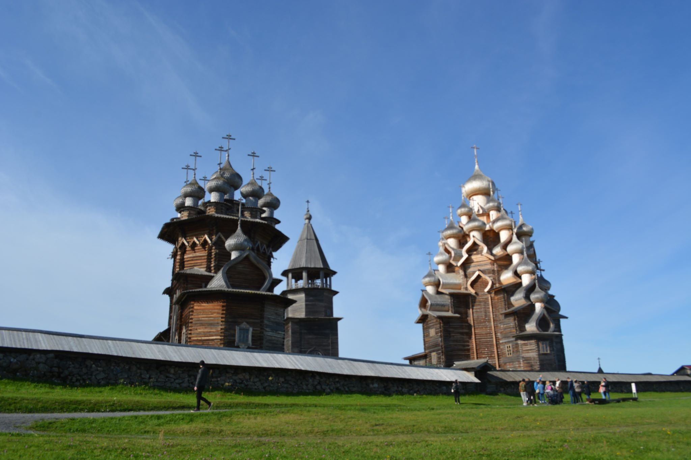
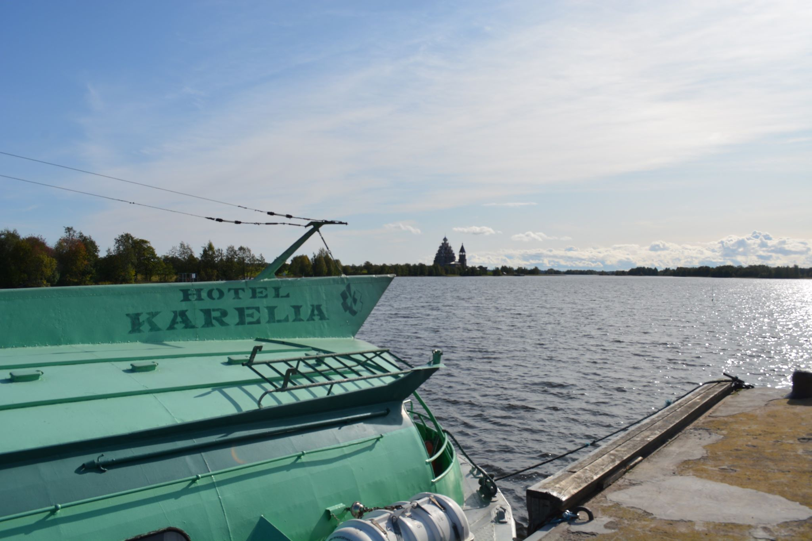
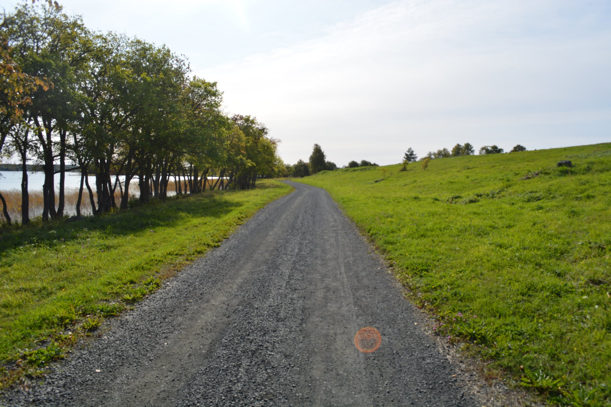
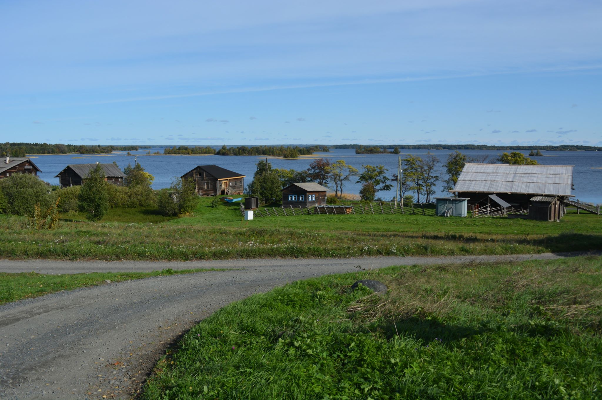

# The Kizhi Island Pigrimage
<i>September 2019</i>

## Introduction

Kizhi Island, Russia is home to the 17th-century Kizhi Pogost (<i>Кижский погост</i>), which is comprised of the Church of the Transfiguration (<i>Церковь Преображения Господя</i>), the Church of the Intercession of the Virgin Mary (<i>Церковь Покрова Пресвятой Богородицы</i>), and a bell tower; Orthodox Christian (<i>православный</i>) services are still held there during the summer seasons. Beyond that, the island is home to more than thirty Kizhi is located in the Korelia region, which has alternately been under the jurisdiction of Sweden, Finland, and Russia. Joseph Stalin regained the territory from the Finns during the three-month Winter War of 1939 at the cost of around 150,000 Soviet lives citing the region's proximinity to Leningrad (modern-day Saint-Petersburg) as the reason for launching his invasion.

Kizhi Island is accessible from the nearby city of Petrozavodsk (<i>Петрозаводск</i>), the latter being founded in 1703 by Pyotr I the Great in order to exploit the region's rich iron ore resources for his burdgeoning Baltic Fleet, but archaeological evidence shows that the area has been inhabited for thousands of years. The eastern bank of Lake Onega is decorated by almost twenty kilometers of Neolithic period petroglyphs dated back more than 10,000 years.[1](#further-reading)

Even more confounding is the Petrozavodsk Phenomenon, which occurred in 1977. The phenomenon was a series of visual events which some have called a malfunctioning satellite that was launched by the Soviet government, some have called an environmental occurrance similar to the Aurora Borealis, and others have described as a visit by extraterrestrial life. Whatever happened that chilly September evening 42 years ago, the Academy of Sciences of the USSR (<i>Академия наук СССР</i>) launched an investigation into the events but was unable to reach any kind of definitive conclusion.[2](#further-reading)

Suffice to say, making the six-hour drive from Saint-Petersburg to Petrozavodsk and then the ninety-minute boat voyage to Kizhi Island itself was a small price to pay to visit a place with such storied history. This essay and its accompanying photographs seek to capture the beauty of Kizhi Island while providing some historical commentary to accompany those observations.

## Kizhi Island

Arriving at the docks in Petrozavodsk to begin the journey, I was expecting to find myself among endless tourists to the idyllic island-- I was not disappointed. We boarded the Soviet-era so-called Rocket boat and set off. Thankfully, because I was travelling independent of any kind of tour group, as soon as we docked on the island, I was able to break away from the crowd and explore the island for myself.

The island itself is brilliant; Kizhi is free from any kind of overcrowding, litter, or modernity in general-- a welcome change from Saint-Petersburg, a city of (officially) eight million. There are a handful of small communities across the island's five square kilometers, but they are only temporary residents. If one makes even a tertiary effort, it is not difficult to find yourself alone.

Walking along the shores of Kizhi Island, you encounter various seventeenth-, eighteenth-, and nineteenth-century wooden constructions designed in the classic Slavic style of woodoworking which affords an architect the ability to join beams, thatch rooves, and build livable structures in many cases without the use of traditional iron nails. These techniques evolved primarily because of the surrounding resources of the region available to early settlers-- an abundance of timber was available but the technologies required to mine iron ore had yet to be developed. These methods eventually made their way back to Scandinavia in a sort of reverse cultural osmosis that occurred upon viking integration into Slavic societies during the nineth century. That is, Scandinavian settlers are generally credited with bringing new weapons and consumer technologies to the agrarian Eastern Slavs, but the latter are rarely credited with introducing the building methods that those settlers would spread in their respective homelands. It could be hypothesized that the modern Ikea-level efficiency that Northern Europeans are known for is the result of Slavic influence.[3](#further-reading)

## Further Reading

1. United Nations Educational, Scientific, and Cultural Organization (UNESCO); <i>[Petroglyphs of Lake Onega and the White Sea](https://whc.unesco.org/en/tentativelists/6358/)</i>; 2018
2. Gindilis, L.M., Menkov D.A., Petrovskaya I.G.; Academy of Sciences of the USSR; <i>[The 20 September Phenomenon: Description of Occurance. Preliminary Data Analysis](http://www.astronet.ru/db/msg/1169491/2_2.htm)</i> (in Russian); 1977
3. Fedorenko, O.A., Scheglova, T.K.; <i>[Traditional Building Techniques](https://www.altspu.ru/p_arh/english/tradition/build.html)</i>