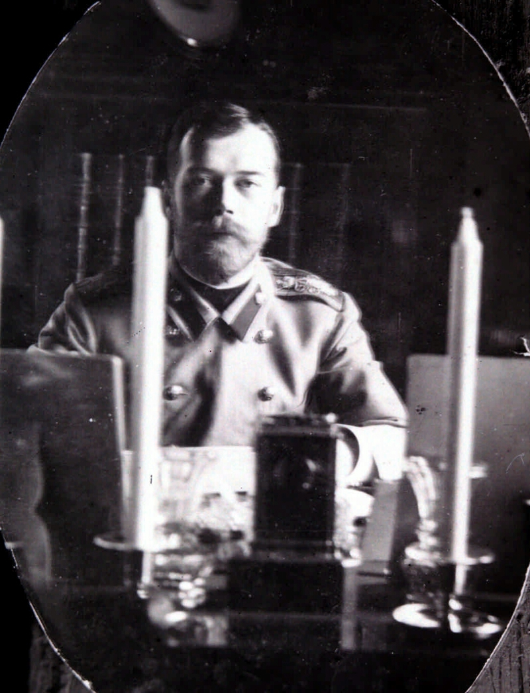
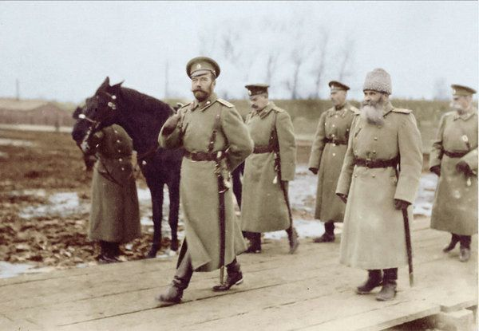
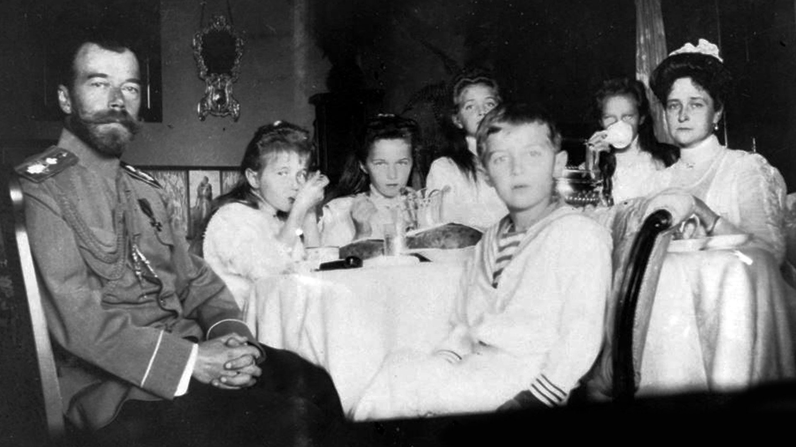
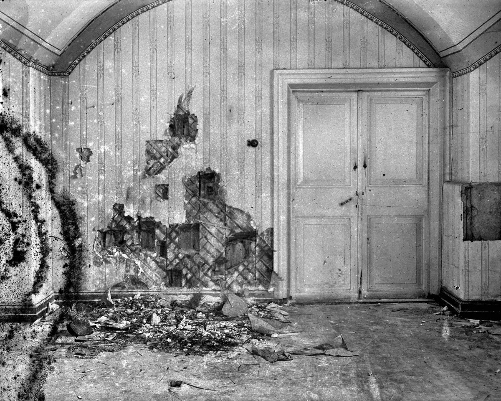

# Apologia for Nikolai II
<i>October 2019</i>

I was inspired to write a defense of the penultimate Romanov emperor (who was then going by the original imperial title Tsar once more) Nikolai Aleksandrovich Romanov-- crowned Nikolai II-- upon finishing Sebastian Sebag Montefiore's grand-scale biography of the royal family, <i>The Romanovs</i>. Montefiore ended his book with the following quote, supposedly from current president of the Russian Federation Vladimir Putin among peers at his [Novo-Ogareva residence](https://nedvijdom.ru/srar-house/rezidentsiya-prezidenta_rossii.html#i):

> The greatest criminals in our history were those weaklings who threw power on the floor-- Nikolai II and Mikhail Gorbachev-- who allowed power to be picked up by hysterics and madmen.

After reading that (it turns out, quite frequently cited quotation[[1](https://www.thetimes.co.uk/article/inside-the-court-of-president-putin-no-extravagance-only-loneliness-hd609sdqdwq)][[2](https://www.themoscowtimes.com/2015/03/18/putin-a-soviet-leader-for-the-21st-century-a44889)]) I was compelled to find its source. Unmentioned in <i>The Romanovs</i>: that quote originated in a 2014 Newsweek article by Ben Judah who cites a person called 'the Court Interpreter.'[[3](https://www.newsweek.com/2014/08/01/behind-scenes-putins-court-private-habits-latter-day-dictator-260640.html)] I suppose calling into question the validity of that quortation would be in bad taste, as this is not really supposed to be about the source of the idea but rather the idea itself: <i>Should Nikolai II be regarded as a traitor to Russia and a weak leader?</i>

As the title above implies, I believe that answer to be a resounding no.

Nikolai II was an imperfect, bigoted, and occasionally hapless leader. I concede all that. But a traitor? And worse than that, a <i>weak</i> traitor? I beg to differ.

This is a person who inherited an empire that witnessed some form of armed insurrection under nearly every ruler who took power from the time that Pyotr I (the Great) struggled the succeed the throne in the seventeenth century. Perhaps that may just lead a reader to support the negation of my proposal with the idea that had Nikolai II just had his wits about him, he would have simply crushed the insurrection like nearly every Romanov had done before him; I think the overall efficacy of a hugely centralized system like the Russian autocracy is likely to be enormously handicapped in the twentienth century of stock markets, wide-spread industrialization, and organized Marxism when compared to every earlier interation of the Romanov dynasty (including the one managed by his own grandfather Aleksandr II, who had died at the hands of assassins in 1881).

The shrewdness of the Emperor's nemesis-- personified by the revolutionaries of 1905 and ultimately 1917-- is fathomless. Nikolai himself was of middling talent and competence (a flaw which would normally not have been fatal to the autocracy) but when matched up against the gile of men like Iosef Stalin, Lev Trotsky, Vladimir Lenin, and about a half dozen or so other outstanding Marxist revolutionaries (as well as plenty of far more violent individuals of unspectular talent as well), it proved to be an absolute death knell.

Perhaps the header 'apologia' is a bit melodramatic. I don't seek to claim that Nikolai II was either enlightened or brilliant, but rather, unexceptional. Being unexceptional was a trait evinced many times throughout Romanov rule-- indeed, unexceptionalism might be the single most uniting factor of all humanity. 

Nikolai II was in an utterly untenable position from the beginning of his reign-- he ruled for 10 years before the Russian Revolution of 1905 was in full force. Within 10 more the nation was myred in world war and a second revolution. The Bolsheviks were correct in their Materialist perspective-- at some point, the number of obstacles which had to be overcome simultaneously was simply too great.

This is the inherent flaw of the current understanding of the Romanov dynasty under the control of Nikolai II: the fixation on Nikolai II-- a man who was product of his times. His downfall was that he failed to make his times a product of himself.

The Romanovs had ruled the Russian Empire, and the Moscovy Tsardom before that, for more than 300 years on 6 November, 1917 N.S. but November Revolution doesn't quite have the same ring and the Julian-dating convention, as was in use in Russia at the time, puts its eve on 24 October.

Nikolai II was the twenty-second Romonov-line autocrat (or about the twenty-second, if you want to be picky about what constitutes a ruler of Russia). The Romonovs could trace their history (reliably) back to the fourteenth century, when their earliest ancestor was working for minor Moscovy nobility before a state called 'Russia' even existed, and if they really stretched it, they could push that pedigree back to the ninth century when the Rurikid dynasty (from which the Romanov dynasty was ultimately cleaved) is purported to have to begun in <i>The Russian Primary Chronicle</i>.

In 1917, Nikolai II had exactly zero reasons to believe:

* The revolution would be successful.
* The people desired his abdication.
* The Romanov line would end under his stewardship.

Now of course, just because Nikolai II had no reason to believe something that the rest of the Russian nobility, Bolshevik leadership, and German aristocracy could see quite clearly didn't mean it wouldn't be so, but the point I'm trying to make is the typical understanding of Nikolai II is too short-termist a framework from which to observe him. That said, I fully accept that Nikolai II thought in terms that were so short-termist that he often missed the forest for the trees himself.

What was he going to do after he quelled the October Revolution? Probably the same things he had been doing before and during it: continue to resist the democratization of his country. Chain smoke. Play cribbage. Vacation in Crimea. Pillow fight with his son and daughters. Write weird love letters to his wife. He liked hunting-- a lot actually. He is purported to have shot over 1,000 pheasants one trip. He was an amateur photographer. He liked cycling.

This is a man that the word 'aloof' does not even begin to describe.

Well over 75% of his personal diary from the period concerns his shockingly banal private affairs and has nothing to do with the state over which he was the God-ordained autocrat, and was also completely collapsing all around him amid a revolution and a war unlike any others which the people of the era had ever seen before.[[4](https://www.prlib.ru/en/node/331412)]

1917 wasn't even the first time his subjects had tried to depose him. The late Christopher Hitchens, inveterate semi-ironic Troskyist, described the botched first attempt a decade earlier thus:

>The real missed opportunity for Russia is 1905, because if that doesn't work, then it's another decade of tsarism and then a terrifying war which is the wreckage of the whole country. [[5](https://www.youtube.com/watch?v=cuzXR-5w4Qk&feature=youtu.be&t=220)]

But even before that, anarchists had tried to assassinate his father Aleksandr III. They'd succeeded in getting his grandfather Aleksandr II. His great-grandfather Nikolai I had had to put down the Decemberist uprising immediately upon succeeding the throne. Back one more generation and you're at Pavel I: assassinated inside [the castle he'd built to protect himself from that fate exactly](https://static.avemedia.ru/mikhcastle/mc.jpg), by a conspiratorial group which included his wife-- the same fate (including the conspiratorial wife) which befell Pavel I's father, Pyotr III. That wife by the way, Yekaterina II, immediately had to put down a massive peasant insurrection led by a guy who alternatively claimed to be fighting for her deposed husband's honor or to be her deposed husband himself. Back a few more generations and you're at Ivan VI, the infant emperor who lived his life in solitary captivity in a remote prison cell after being deposed by his cousin Elizaveta I. A few more generations back and you're at Pyotr I who watched his favorite uncle thrown from a balcony onto the upturned pikes of the streltsy soldiers in active insurrection below, followed by a lengthy co-tsarship with his also-underage half-brother under the aegis of a woman named Sophia, who inspired [this portrait](https://www.msk-guide.ru/img/146/143189big.jpg). <i>Ad nauseam</i>. The Romanovs had come to power in the first place after nearly two decades of various Russian noble families successively dethoroning and executing one another-- think, a medieval French Revolution without all the lofty idealism or sweeping rhetoric, but the guillotine turned up to 11. The first Romanov tsar's mother supposedly burst into tears when the Moscovy elites offered the throne to her son-- they had to practically beg him to accept it (or so the story goes).

The point is, there was always someone trying to kill the emperor or overthrow the emperor or intrigue behind the emperor's back or throw bombs at his bullet-proof carriage. Being a Romanov, and what's worse a Romanov emperor, was a dangerous job. Nikolai II was a simple man. It's not that he was utterly ill-suited for the job, he was just middle-suited for it. Unfortunately for him though, he needed to be super-duper-suited for it because he was inheriting an autocracy that had been imploding for the last several generations and maybe more if you want to have the republic/empire conversation. At a certain point words like 'insurmountable' need to start being thrown around. I'd argue that this is one of those cases.

By Romanov standards, Nikolai II made almost all the right decisions: I fail to see a Romanov leader who does not underestimate the Japanese Navy in 1904. I think only a select few would have backed down during the build up to World War I (and more out of Germanophilia, the sort of which led Pyotr III to stop waging war with the Hohenzollern King in Prussia Frederick II the Great immediately upon the former's succession, rather than any kind of brilliant streak of international relations foresight). Perhaps a more daring leader like Alexei I might have ridden out to meet the protesters on Sunday, 9 January 1905 O.S. as he had done during the Salt Riots of the mid-seventeenth century, but even then-- Alexei I only rode off with his life after allowing the boyar who levied the contentious tax to be bludgeoned to death in the streets. And it seems nigh impossible an equivalent or better outcome would arise against the backdrop of the late imperial period. As I enumerated above, none of the Romanovs were overly shy about bringing arms to bear against their polity-- in the macabre grand scheme of things, Nikolai II had not even been an especially repressive ruler to that point. Bloody Sunday killed about a sixth of the amount of people killed by the Socialist Revolutionaries and their ilk in the same year inside the Romanov government.

As for the succession-- even if Nikolai II had had no sons, instead of just one hemophiliac one, the Romanov line would have (and did in fact) continue beyond him. When Nikolai II abdicated he also did so on behalf of his ill son, thus Mikhail Aleksandrovich inherited the throne (which he refused to accept until a resolution was passed by the government endorsing the decision, showing that absolute delusion with respect to the position of the imperial throne in the eyes of its subjects was not a trait totally unique to Nikolai II). Had the former succeeded though, he would have become Mikhail II-- the irony of fate is highlighted once again when one remembers Mikhail I (born Mikhail Fyodorovich) was the first Romanov Tsar. The would-be Mikhail II was its last.

Nikolai II is likely to have expected that a few more Bloody Sundays might need to happen during his lifetime, but after his death in his solipsistic understanding of the world, he had no reason to believe that either Alexei or one of the girls wouldn't inherit his throne and the Romanovs would go on ruling Russia just as God intended. Remember that Wilhelm II was Nikolai II's cousin, as was George V of England (both belligerents in the war). World War I was a travesty, and totally unique in its carnage to that point, but for the most part it was still more or less occurring within the existing paradigm of the world order at the time. Not a ton of contemporary thinkers were predicting a revolution in England, Russia, and Germany as being imminent-- even less were predicting two of those would succeed.

Furthermore, there were only limited restrictions on female inheritance-- male inheritance was definitely preferred, but one of the two Romanov rulers to whom the moniker 'the Great' was appended was female, a number of women deposed men to take the throne, and in the absence of a living male heir from the ruling branch's line, a female would inherit. Nikolai II's oldest daughter, Olga, was the subject of much royal match-matching with suitors all over Europe so to say the Romanovs weren't at least hedging their bet on male inheritance vis-a-vis Alexei would be obtuse.

At the end of the day, Nikolai II failed to grasp what was happening in the country around him. He failed to grasp it so magnificently that he had no idea what was coming. At any given point. Even after he abdicated. Even after he was taken prisoner by the Bolsheviks, and even as the young intellectuals guarding him and flirting with his daughters were replaced by grizzled front-liners who stopped being so nice. And even as they led him and his loved ones down to a basement under the guise of taking a family photo (at 3 am) before relocating them to safer quarters. And yes, even after the half-drunk Red Army soldiers sauntered out of the adjoining room pointing their guns at his chest.

His last words were confused screaming asking his executioners to reread the order passed down from the Presidium of the Ural Regional Soviet sentencing himself and his entire family to death by firing squad. Nikolai II had no concept of what would happen after the revolution because in his mind, the revolution never started. The war would just come to an end at some point-- these things always had ways of resolving themselves, and these were men with whom he could do business. The revolutionaries would lose support-- they always did. These things have a way of resolving themselves. Alexei would get better-- he always did.

Nikolai II's final diary describes the unusually warm July weather, he got to swim twice that day. He caught up on some reading. Took a nice walk. Nothing seems to indicate the dire circumstances in which he found himself. No worries about the future. No plans for after the war. Nikolai II didn't really think about that kind of thing.

