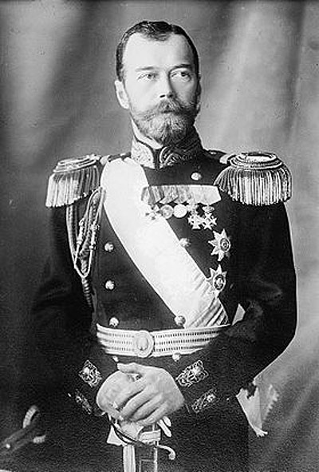
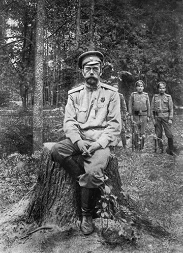
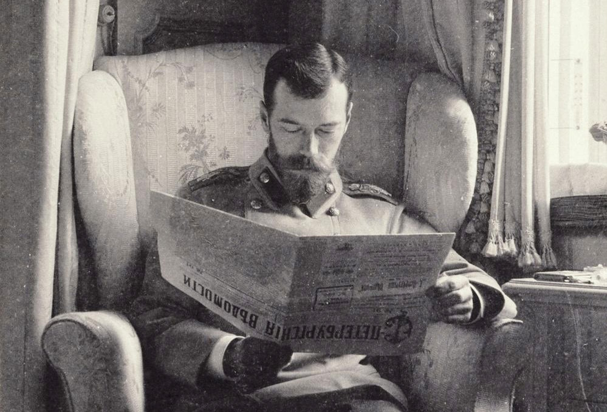

# Apologia for Nikolai II
<i>October 2019</i>

I was inspired to write a defense of the final Romanov emperor (who was then going by the original imperial title Tsar once more) Nikolai Aleksandrovich Romanov-- crowned Nikolai II-- upon finishing Sebastian Sebag Montefiore's grand-scale biography of the royal family, <i>The Romanovs</i>. Montefiore ended his book with the following quote, supposedly from current president of the Russian Federation Vladimir Putin among peers at his [Novo-Ogareva residence](https://nedvijdom.ru/srar-house/rezidentsiya-prezidenta_rossii.html#i):

> The greatest criminals in our history were those weaklings who threw power on the floor-- Nikolai II and Mikhail Gorbachev-- who allowed power to be picked up by hysterics and madmen.

After reading that (it turns out, quite frequently cited quotation[[1](https://www.thetimes.co.uk/article/inside-the-court-of-president-putin-no-extravagance-only-loneliness-hd609sdqdwq)][[2](https://www.themoscowtimes.com/2015/03/18/putin-a-soviet-leader-for-the-21st-century-a44889)]) I was compelled to find its source. Unmentioned in <i>The Romanovs</i>: that quote originated in a 2014 Newsweek article by Ben Judah who cites a person called 'the Court Interpreter.'[[3](https://www.newsweek.com/2014/08/01/behind-scenes-putins-court-private-habits-latter-day-dictator-260640.html)] I suppose calling into question the validity of that quortation would be in bad taste, as this is not really supposed to be about the source of the idea but rather the idea itself: <i>Should Nikolai II be regarded as a traitor to Russia and a weak leader?</i>

As the title above implies, I believe that answer to be a resounding no.

Nikolai II was an imperfect, bigoted, and occasionally hapless leader. I concede all that. But a traitor? And worse than that, a <i>weak</i> traitor? I beg to differ.

This is a person who inherited an empire that witnessed some form of armed insurrection under nearly every ruler who took power from the time that Pyotor I (the Great) struggled the succeed the throne in the seventeenth century. Perhaps that may just lead a reader to support the negation of my proposal with the idea that had Nikolai II just had his wits about him, he would have simply crushed the insurrection like nearly every Romanov had done before him; I think the overall efficacy of a hugely centralized system like the Russian autocracy is likely to be enormously handicapped in the twentienth century of stock markets, wide-spread industrialization, and organized Marxism when compared to every earlier interation of the Romanov dynasty (including the one managed by his own grandfather Aleksandr II, who had died at the hands of assassins in 1881).

The shrewdness of the Emperor's nemesis-- personified by the revolutionaries of 1905 and ultimately 1917-- is fathomless. Nikolai himself was of middling talent and competence (a flaw which would normally not have been fatal to the autocracy) but when matched up against the gile of men like Iosef Stalin, Lev Trotsky, Vladimir Lenin, and about a half dozen or so other outstanding Marxist revolutionaries (as well as plenty of far more violent individuals of unspectular talent as well), it proved to be an absolute death knell.

Perhaps the header 'apologia' is a bit melodramatic. I don't seek to claim that Nikolai II was either enlightened or brilliant, but rather, unexceptional. Being unexceptional was a trait evinced many times throughout Romanov rule-- indeed, unexceptionalism might be the single most uniting factor of all humanity. Nikolai II oversaw reasonably paced reforms. Even his dissolution of the Duma wasn't particularly earth-shattering. Napoleon III of France had done the same thing to retain power just half a century earlier. He wasn't ousted from power for another 20 years until (eerily foreshadowing Nikolai II's own fall) he bungled the war effort during the Franco-Prussian War of 1870.

Nikolai II was in an utterly untenable position from the beginning of his reign-- he ruled for 10 years before the Russian Revolution of 1905 was in full force. Within 10 more the nation was myred in world war and a second revolution. The Bolsheviks were correct in their Materialist perspective-- at some point, the number of obstacles which had to be overcome simultaneously was simply too great.

This is the inherent flaw of the current understanding of the Romanov dynasty under the control of Nikolai II: the fixation on Nikolai II a man who was product of his times. His fatal flaw was that he failed to make his times a product of himself.

