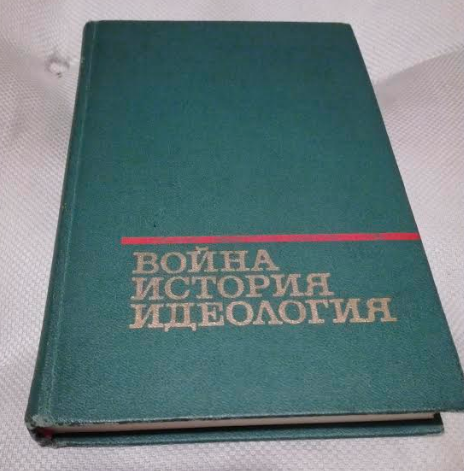

# Analysis of 'War, History, Ideology'
<i>November 2019</i>

## Overview

<i>War, History, Ideology</i> is a publication by the Ministry of Defense of the Soviet Union which was released in 1974, I will present a review of this book. I think reviewing this document is important in the context of modern geopolitics because much of the rhetoric espoused therein is common in the modern American chique political classes. The review of a historical document which makes similar claims as members of the enlighted generation of poltiical thinkers shows that Marxism (and to a certain extent, Marxism-Leninism) is still quite a powerful school of thought, and the fact that its progenerator goes uncited does not detract from its coercive power.

